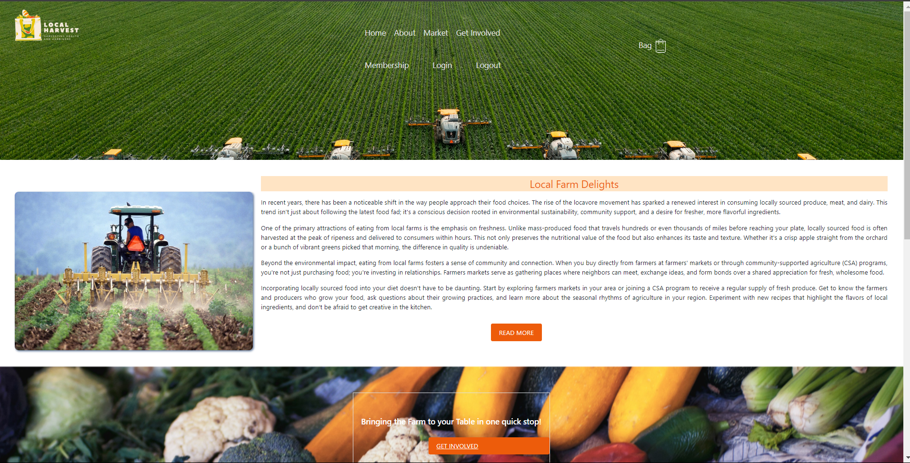

# Group Project: Local Harvest App

## Overview Description
Welcome to The Code Crusaders

We are a team of five programmers tasked with creating a website for our local farmer's market. 

## Group Project - Acceptance Criteria

 You will build a web application, the subject is yours to choose, that meets the following criteria:

●	You will decide on an MVP (Minimal Viable Product) . You don't need to clear it with the instructors before starting; but you're welcome to.
●	Use some kind of project management software (Trello, Github Project etc) to track what tasks everyone is working on.
●	Must be a full MERN app. It will use Express on the server side (with the MVC structure) and React on the client side. You can use whatever database you want. You may use either RESTful APIs or GraphQL.
●	It uses Bootstrap or some CSS library, along with whatever custom CSS you write. The site must be responsive. In place of a generic CSS framework, you can also use a React-based UI framework like React-Bootstrap, Chakra, etc.
●	Must be responsive (mobile and desktop).
●	Must use at least one new technology, library, etc… This can be a third-party React library or Node package, or an external API of some sort.
●	Questions Limit:  Each group will be limited to a maximum of 12 instructor/TA coding-related questions.

●	Server requirements:
○	Must have at least three models, one of which must be a User model. It should have all necessary functionality to support authentication (signup, login, and logout). The user password must be encrypted.
○	Seeding is recommended but not required

●	React requirements:
○	Must use React Router or a similar package and have at least three distinct pages. There must be at least three distinct components used also. Must use React Context or Redux for state management.
○	Must have a signup and login form. One or more pages must be restricted to only logged-in users.

●	All code must clean and well-organized, with good file structure 
●	No alerts, prompts, or confirms. Use modals instead.
●	No obvious bugs, no errors in dev console or terminal
●	Frequent code commits by all members 
●	The README file will be well-organized and have:
○	Project description
○	Team members 
○	Screen shot 
○	Link to deployed version on Render 
●	Final code must be deployed to Render (or any viable host) by the evening of the presentation
●	Only one repo needs to be managed per group. 

## The presentation:
It will last about 10-15 minutes
It will be accompanied by a Google Slides doc 
Every group member will have a turn at speaking
You will discuss:
Your initial idea and the MVP you decided on
Your tech stack
Challenges you faced 
Things which went right; things you struggled with 
Ideas for expansion
Quick demo of the working site

## Final submission:
Each member will submit a link to the shared repo, and to the Render
(All members will be submitting the same two links)
Each member will also grade their teammates on a scale of 1 to 5 for the following:
Participation
Willingness to take on difficult work
Reliability
These grades will be seen ONLY by instructional staff 

## Media Attachments

Below is a screen shot of the Home Page (Desktop), AboutUs Page, Market & Get Involved Page.

The Home Page.

The AboutUs Page.

The Market Page.

The Get Involved Page.

The Presentation.
[Click Here](https://docs.google.com/presentation/d/1N5yuJ6h-Y7GNsJnzsXVOtqGa2kDZ-UAMI6lU7HDtgQ8/edit#slide=id.p) 

## Our Company: Code Crusaders.
- Daisy
- Joel
- Kee
- Rey
- Whoughie

## Acknowledgements & Technology Stacks

- Technology Stack
    - MongoDB
    - Express.js
    - React.js
    - Node.js 

- CSS
   - Custom CSS
   - Bootstrap

 

- JavaScript
   - JQuery

 

- New Technology Stack
    -Gsap Stagger from [gsap.com](https://gsap.com/resources/getting-started/Staggers/)
- SplitType from (https://www.npmjs.com/package/split-type
    )

 

- Misc Software
   - Jira
   - Render

 

- Presentation Material
   - Google Slides

## Deployed Application:
[Click Here](https://github.com/whougie/local-harvest) to view the Repository for this project.

[Click Here]() to view the deployed version of the web application. 

